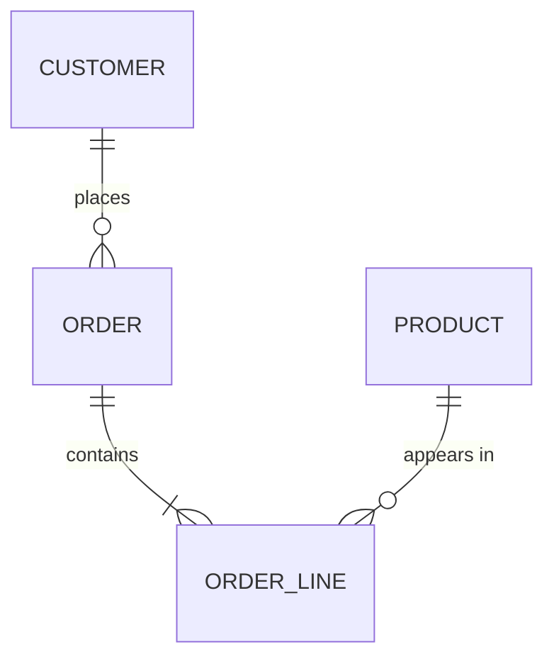

# 02 — Conceptual ER Model · Mô hình khái niệm

Project: `ecommerce-mini` · Entities: 4 · Relationships: 3

## ERD

## Entity catalog

| Entity | Definition (EN) | Định nghĩa (VI) | Kind | Business key | From |
|---|---|---|---|---|---|
| customer | A person who places orders | Người đặt hàng | independent | customer_code | EN-001 |
| product | An item offered for sale | Mặt hàng được bán | independent | product_code | EN-002 |
| order | A purchase request by one customer | Yêu cầu mua của một khách | independent | order_code | EN-003 |
| order_line | One product within an order | Một dòng hàng trong đơn | **weak** (of order) | (order, line_no) | EN-004 |

## Relationship catalog

| ID | Reads as (EN) | Đọc là (VI) | Cardinality | Mandatory | Has attributes | Temporal |
|---|---|---|---|---|---|---|
| R-01 | a customer places 0..n orders; an order belongs to exactly 1 customer | một khách đặt 0..n đơn; một đơn thuộc đúng 1 khách | 1:N | order→customer required | no | no |
| R-02 | an order contains 1..n lines; a line belongs to exactly 1 order | một đơn có 1..n dòng; một dòng thuộc đúng 1 đơn | 1:N | both required (BR-003) | quantity, unit_price | no |
| R-03 | a product appears in 0..n lines; a line names exactly 1 product | một sản phẩm xuất hiện ở 0..n dòng; một dòng nêu đúng 1 sản phẩm | 1:N | line→product required | no | **yes — see D-02** |

## Design decisions

| # | Decision | Alternatives considered | Rationale |
|---|---|---|---|
| D-01 | **No `customer_address` entity** | A 1:N `customer → address` entity | The document never states that a customer has more than one address (Q-01). Creating the entity would be inventing a requirement; the delivery address lives on the order, consistent with §3.3's snapshot principle. **Revisit if Q-01 is answered "yes".** |
| D-02 | `order_line` carries its own `unit_price` rather than reading `product.unit_price` | Join to product at read time | BR-002 requires the historical price. This is not denormalization for speed — it is the business fact. |
| D-03 | `order_line` modeled as a weak entity | Independent entity with a surrogate key | A line has no meaning or lifecycle outside its order; §3.1 makes it existence-dependent. |

## Out of scope

| Candidate | Why excluded |
|---|---|
| refund | §3.4 defers it to BA-04, which the intake report puts out of scope. See `XX-001` — the status enum is kept extensible so this can be added without a migration. |
| merchandising / price history | §2.3 mentions price adjustments but no requirement asks for history. See `XX-002`. |

## GAPS

| Use case | Missing | Question for BA |
|---|---|---|
| "Deliver to a customer's usual address" | No `customer_address` entity exists | Q-01 — can a customer have more than one saved address? |
