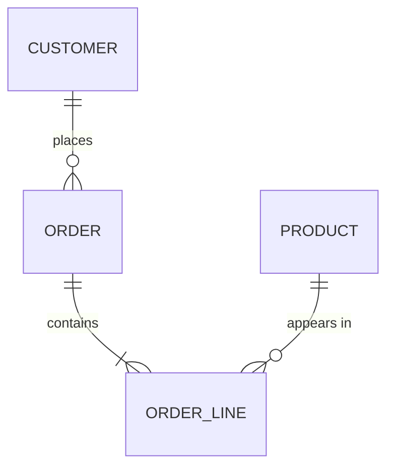

# Stage 2 — Conceptual Model

Mô hình khái niệm nói chuyện với **người làm nghiệp vụ**, chưa phải với DBMS:
chưa có kiểu dữ liệu, chưa có bảng nối, chưa có index.

## Bước 1 — Chốt entity

Từ `EN-*`, quyết định mỗi ứng viên là:

- **Entity độc lập** (có định danh riêng, tồn tại độc lập)
- **Weak entity** (chỉ tồn tại kèm entity cha: `order_line`, `invoice_item`)
- **Attribute** của entity khác (gộp vào, ghi lý do)
- **Enum / reference data** (danh mục trạng thái, loại) — tách bảng hay enum
  quyết định ở Stage 3, ở đây chỉ đánh dấu
- **Không thuộc phạm vi** (ghi vào `OUT OF SCOPE`)

Mỗi entity chốt lại phải có: tên (EN, số ít, snake_case), định nghĩa một câu
(EN + VI), định danh nghiệp vụ (business key), nguồn `DR-*`.

## Bước 2 — Quan hệ

Với mỗi `RL-*` xác định: hai đầu, **cardinality** (1:1, 1:N, M:N),
**optionality** mỗi đầu, và **động từ nghiệp vụ** đọc được theo hai chiều
("một `customer` đặt 0..n `order`; một `order` thuộc đúng 1 `customer`").

Kiểm tra bắt buộc:
- M:N → ghi nhận sẽ thành bảng liên kết ở Stage 3; hỏi xem quan hệ đó có
  **thuộc tính riêng** không (số lượng, thời điểm, vai trò).
- Quan hệ có yếu tố **thời gian/lịch sử** ("giá tại thời điểm đặt") → đánh dấu
  cần versioning, xem `references/modeling-patterns.md §SCD`.
- Vòng lặp quan hệ (cycle) → kiểm tra có dư thừa đường dẫn không.
- Cây phân cấp (đơn vị, danh mục) → đánh dấu self-reference.

## Bước 3 — Vẽ ERD

Dùng Mermaid `erDiagram` (render được ở mọi nơi, diff được bằng git):

Nếu >25 entity, tách thành nhiều sơ đồ theo phân hệ (subject area) + một sơ đồ
tổng quan chỉ có entity trung tâm.

## Bước 4 — Đối chiếu ngược

Đi lại toàn bộ `PR-*` (use case): mỗi use case phải thực hiện được bằng các
entity/quan hệ hiện có. Use case nào không đi trọn được → thiếu entity hoặc
thiếu quan hệ. Ghi vào phần `GAPS`.

## Artifact & Gate

`workspace/<project>/02-conceptual-erd.md` ← `templates/02-conceptual/02-conceptual-erd.md`.

Trình bày ERD + bảng entity + danh sách quyết định (entity nào bị gộp/loại, vì
sao). Đây là điểm dừng để người làm nghiệp vụ xác nhận — sai ở đây thì mọi thứ
sau đều sai. Cập nhật `STATE.md`, sang Stage 3.
