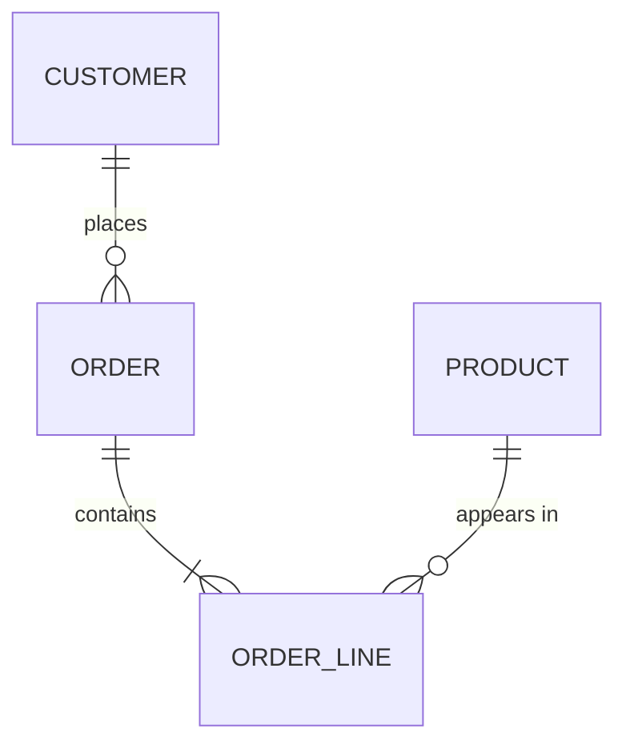

# 02 — Conceptual ER Model · Mô hình khái niệm

Project: `<slug>` · Entities: `<n>` · Relationships: `<n>`

## 1. Subject areas · Phân hệ

| Area | Entities | Note |
|---|---|---|

## 2. ERD

> Ký hiệu: `||` đúng một · `o|` không hoặc một · `}o` không hoặc nhiều · `}|` một hoặc nhiều.
> Nếu >25 entity: tách sơ đồ theo phân hệ, giữ một sơ đồ tổng quan.

## 3. Entity catalog

| Entity | Definition (EN) | Định nghĩa (VI) | Kind | Business key | From |
|---|---|---|---|---|---|
| customer | | | independent | customer_code | EN-001 |
| order_line | | | weak (of order) | (order_id, line_no) | EN-004 |

Kind: `independent` · `weak` · `associative` · `reference/enum`

## 4. Relationship catalog

| ID | Reads as (EN) | Đọc là (VI) | Cardinality | Mandatory? | Has attributes? | Temporal? | From |
|---|---|---|---|---|---|---|---|
| R-01 | a customer places 0..n orders | một khách hàng đặt 0..n đơn | 1:N | order→customer bắt buộc | no | no | RL-001 |

## 4b. Cross-cutting principle · Nguyên tắc xuyên suốt

Hệ thống này thực chất phải **chứng minh** điều gì?

**Nguyên tắc (một câu):** `<...>`

| Áp dụng ở đâu | Entity / quan hệ | Hệ quả thiết kế |
|---|---|---|

Nếu không tìm ra nguyên tắc nào, ghi rõ *"đã tìm, không có nguyên tắc lặp lại"* —
đừng bỏ trống.

## 5. Design decisions · Quyết định

| # | Decision | Alternatives considered | Rationale |
|---|---|---|---|
| D-01 | Gộp `contact_info` vào `customer` | bảng riêng | không tồn tại độc lập, 1:1 bắt buộc |

> `D-*` là namespace của **quyết định mô hình ở stage này**. Denormalization ở
> Stage 3 dùng `DN-*` — không dùng lại `D-*`.

## 6. Out of scope · Ứng viên bị loại

| Candidate | Why excluded |
|---|---|

## 7. GAPS · Use case chưa đi trọn được

| Use case (PR-*) | Missing entity / relationship | Question for BA |
|---|---|---|
